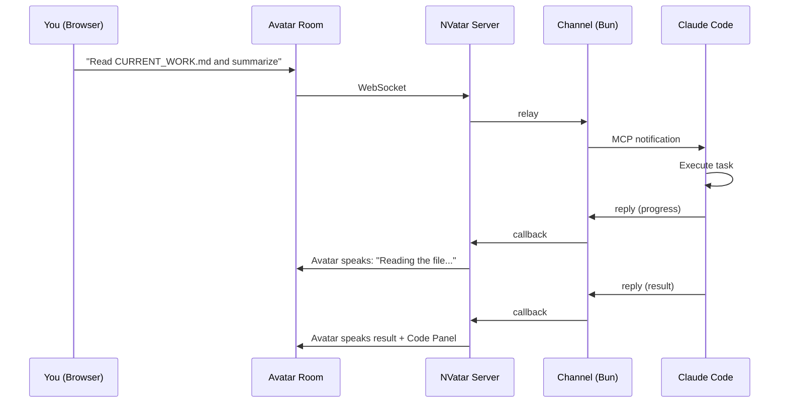
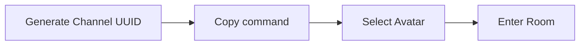
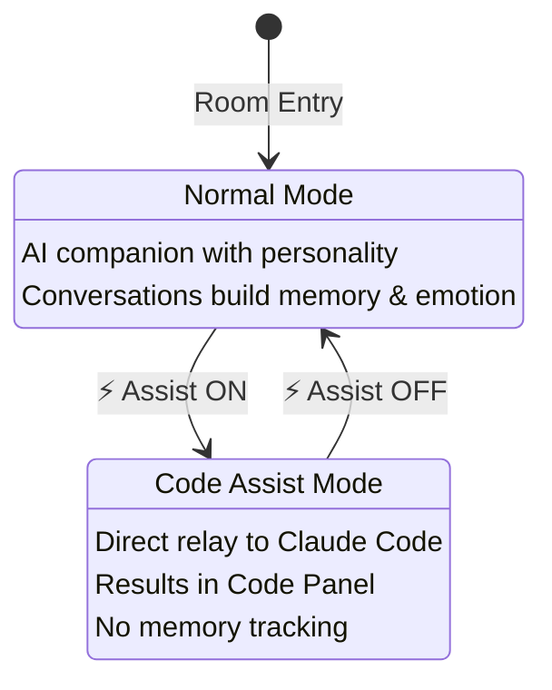
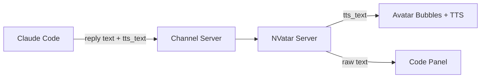
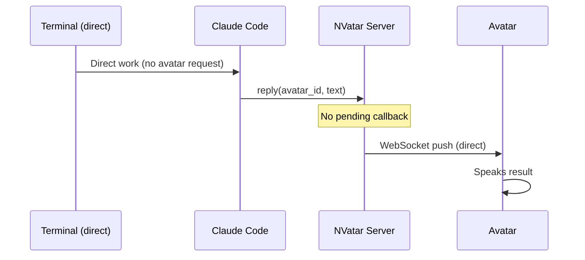
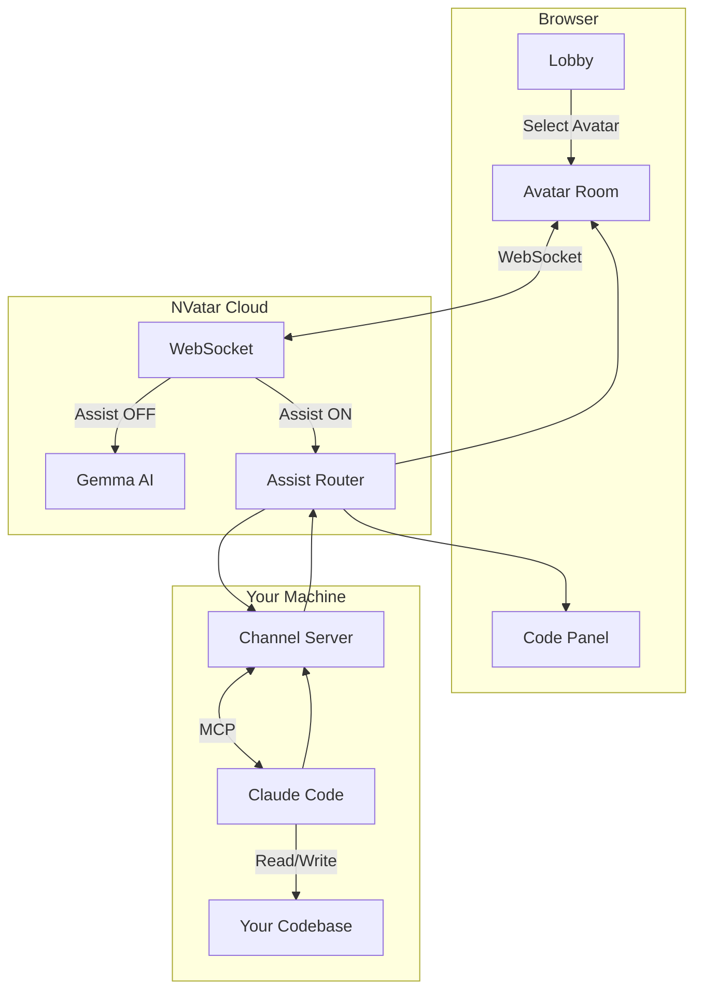
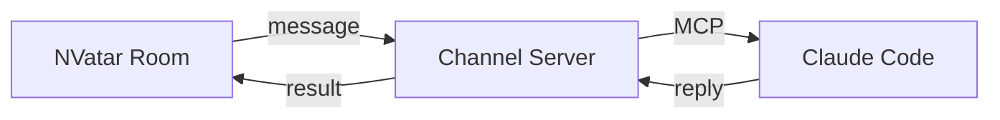

# NVatar Code Assist

> **Your 3D AI avatar becomes a code assistant — powered by Claude Code.**

NVatar Code Assist connects your [NVatar](https://github.com/nskit-io/nvatar-demo) avatar to a local [Claude Code](https://claude.ai/claude-code) session. Give code commands to your avatar, and Claude Code executes them on your machine.

**[Live Demo](https://nskit-io.github.io/nvatar-code-assist/)** · [한국어](docs/README_KO.md) · [日本語](docs/README_JA.md) · [中文](docs/README_ZH.md)

---

## How It Works



## Quick Start

### What You Need

- [Claude Code](https://claude.ai/claude-code) v2.1.80+
- [Bun](https://bun.sh/) runtime

### Step 1: Clone & Install

```bash
git clone https://github.com/nskit-io/nvatar-code-assist.git
cd nvatar-code-assist/channel
bun install
```

### Step 2: Open the Lobby

Visit **[https://nskit-io.github.io/nvatar-code-assist/](https://nskit-io.github.io/nvatar-code-assist/)**



1. Click **Gen** to generate a Channel UUID
2. Copy the terminal command shown below

### Step 3: Start Claude Code Channel

Paste the copied command in your terminal:

```bash
NVATAR_CHANNEL_UUID=<your-uuid> claude --dangerously-load-development-channels server:nvatar
```

> **Important:** Start the channel BEFORE entering the room.

### Step 4: Enter Room & Toggle Assist

1. Select your avatar in the lobby and enter the room
2. Chat normally with your avatar first (greeting, set your name, etc.)
3. When ready for code work, click **⚡ Assist** in the toolbar
4. Give code commands — Claude Code executes them!

## Two Modes



### Normal Mode (default)

Your avatar is a conversational AI companion. It has personality, memory, emotions, and speaks with TTS. Daily conversations are saved and the avatar evolves over time.

### Code Assist Mode (⚡ toggle)

Messages relay directly to Claude Code. The avatar becomes a transparent pipe:

| Action | Behavior |
|--------|----------|
| Your message | Sent to Claude Code |
| Progress update | Avatar speaks it |
| Final result | Avatar speaks TTS-friendly text + Code Panel shows raw data |
| Direct push | Claude Code can push results without avatar request |
| Ask avatar's opinion | Avatar responds with context |

**Opinion detection** works in 4 languages — ask your avatar what it thinks about the result:
- 🇰🇷 "어떻게 생각해?" · 🇺🇸 "What do you think?" · 🇯🇵 "どう思う?" · 🇨🇳 "你觉得怎么样?"

### Privacy

> **Code Assist mode does NOT save conversations to the avatar's memory.**

Code Assist results are stored in a separate Code Panel database, NOT in the avatar's Franchise Memory. This is controlled by `save_franchise_memory = false` — the pattern's default for sensitive data. Your code conversations never influence the avatar's personality or become part of its long-term recall.

| | Normal Mode | Code Assist Mode |
|---|---|---|
| Conversation log | Saved (builds personality) | Not saved |
| Emotion tracking | Active | Disabled |
| Franchise Memory | Accumulates over time | Disabled (`save_franchise_memory = false`) |
| Code results | — | Code Panel only (separate storage) |

When you toggle back to Normal Mode, your avatar continues from where you left off.

## TTS-Friendly Response Split

When Claude Code returns results containing tables, symbols, or formatted data, the response is split into two streams:



| Field | Purpose | Example |
|-------|---------|---------|
| `text` | Raw response with tables, code, symbols | `\| Plan \| Price \| ...` |
| `tts_text` | Natural spoken language for the avatar | "Starter is 5 dollars per month..." |

The avatar speaks the TTS-friendly version while the Code Panel displays the full raw data. If `tts_text` is omitted, the avatar reads the raw text as before (backward compatible).

## Server Push (Direct Push)

Claude Code can push results to the avatar **without a prior request**. When you work directly in the terminal and want the avatar to announce the result:



This enables a hybrid workflow: work directly in the terminal, and your avatar stays informed and announces results in real-time.

## Architecture

Code Assist is implemented as a `CodeAssistPattern` — one of several pluggable behaviors in the [NVatar SDK](https://github.com/nskit-io/nvatar-sdk) pattern system. The SDK's BehaviorPattern Registry routes messages to the correct pattern based on mode, so Code Assist runs independently from the avatar's personality engine.



## Claude Code Channel

This project uses **Claude Code Channels** — an MCP-based plugin system that lets external apps communicate with Claude Code.



The `channel/` directory contains the ready-to-use MCP server. Claude Code launches it automatically when you run the start command. No additional configuration needed.

The channel server includes automatic retry (3 attempts, 2s intervals) for MCP notification delivery, ensuring messages reach Claude Code even during brief connection instability.

> For more on Claude Code Channels, see the [Claude Code documentation](https://docs.anthropic.com/en/docs/claude-code).

## Reliability

Code Assist includes multiple layers of retry and error handling:

| Layer | Behavior |
|-------|----------|
| **Channel → Claude Code** | MCP notification retry (3 attempts, 2s intervals) |
| **Server → Channel** | HTTP POST retry (2 attempts, 2s intervals) |
| **Delivery failure** | Simple error bubble — avatar does NOT generate a creative response about the failure |
| **TTS initialization** | `client_ready` handshake ensures TTS is initialized before avatar speaks |

When a message fails to reach Claude Code after retries, the avatar displays a plain error message instead of routing to the local AI (Gemma). This prevents confusing responses where the avatar "makes up" an answer to a code command.

## Service & Limits

| Service | Notes |
|---------|-------|
| **NVatar Server** (`nvatar.nskit.io`) | Hosted service. No local setup needed. |
| **TTS (Voice)** | Shared API quota — may rate-limit during heavy use. Avatar falls back to text bubbles. |
| **STT (Mic Input)** | Stable. Text input always available as fallback. |

> For enterprise deployment with dedicated resources, [contact us](mailto:nskit@nskit.io).

## Troubleshooting

| Symptom | Fix |
|---------|-----|
| Avatar doesn't relay commands | Click **⚡ Assist** to turn on Code Assist mode |
| "서버 연결 대기 중" | Refresh the page — server may be loading |
| Code panel empty after refresh | Make sure you're using the same Channel UUID |
| TTS not working | Browser autoplay policy — interact with the page first |
| Channel not connecting | Restart Claude Code with the same UUID |
| Avatar doesn't move to center when speaking | Fixed — `returnToCenter()` is now called on every bubble event |
| Avatar speaks before TTS is ready | Fixed — `client_ready` handshake defers greeting until scene is loaded |
| Message delivery failed silently | Server now retries 2x with 2s interval; shows error on final failure |

## Project Structure

```
nvatar-code-assist/
├── index.html              # Lobby — avatar selection
├── code-assist.html        # Room — 3D avatar + chat + code panel
├── js/room/                # Room modules (16 files)
│   ├── main-assist.js      # Code assist toggle logic
│   ├── chat.js             # WebSocket + code panel
│   ├── i18n.js             # 4-language translations
│   └── ...                 # scene, animation, tts, stt, mood, etc.
├── vrm/
│   ├── models.json         # Avatar model list
│   └── thumbnails/         # Avatar thumbnails
├── channel/
│   ├── server.ts           # MCP channel server (Bun)
│   └── package.json
└── docs/                   # Translated READMEs (KO, JA, ZH)
```

## NVatarSDK API

For developers integrating with the room:

```javascript
// Subscribe to code results
NVatarSDK.onLookupResult = (data) => { ... };

// Read stored results
NVatarSDK.getLookupResults();
NVatarSDK.getUnreadCount();
NVatarSDK.clearLookupResults();
```

## Related Projects

| Project | Description |
|---------|-------------|
| [NVatar Demo](https://github.com/nskit-io/nvatar-demo) | AI 3D Avatar Chat Platform — the avatar runtime |
| [NVatar SDK](https://github.com/nskit-io/nvatar-sdk) | BehaviorPattern SDK — build pluggable avatar services |

## License

Apache-2.0

---

Built with [NVatar](https://github.com/nskit-io/nvatar-demo) and [NVatar SDK](https://github.com/nskit-io/nvatar-sdk) — AI 3D Avatar Chat Platform
