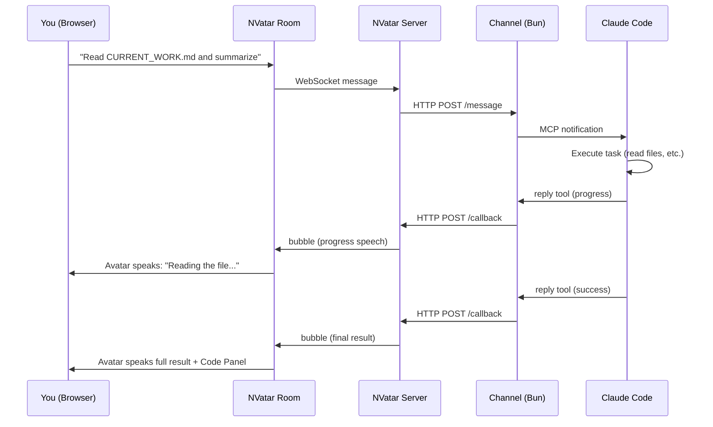
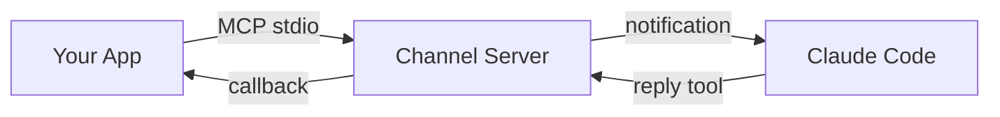
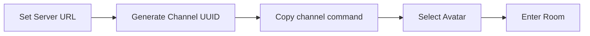
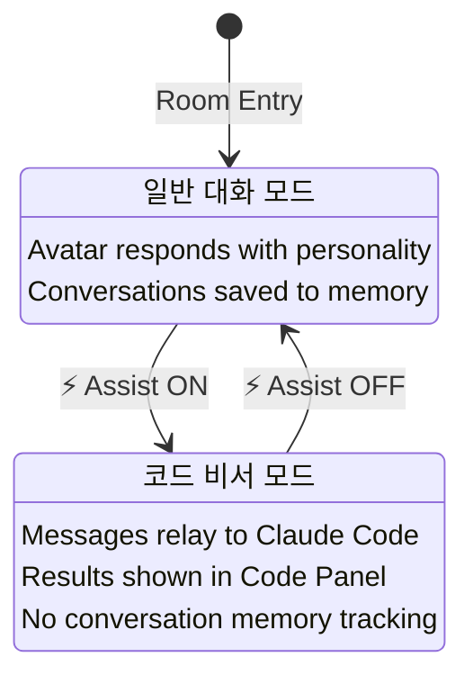
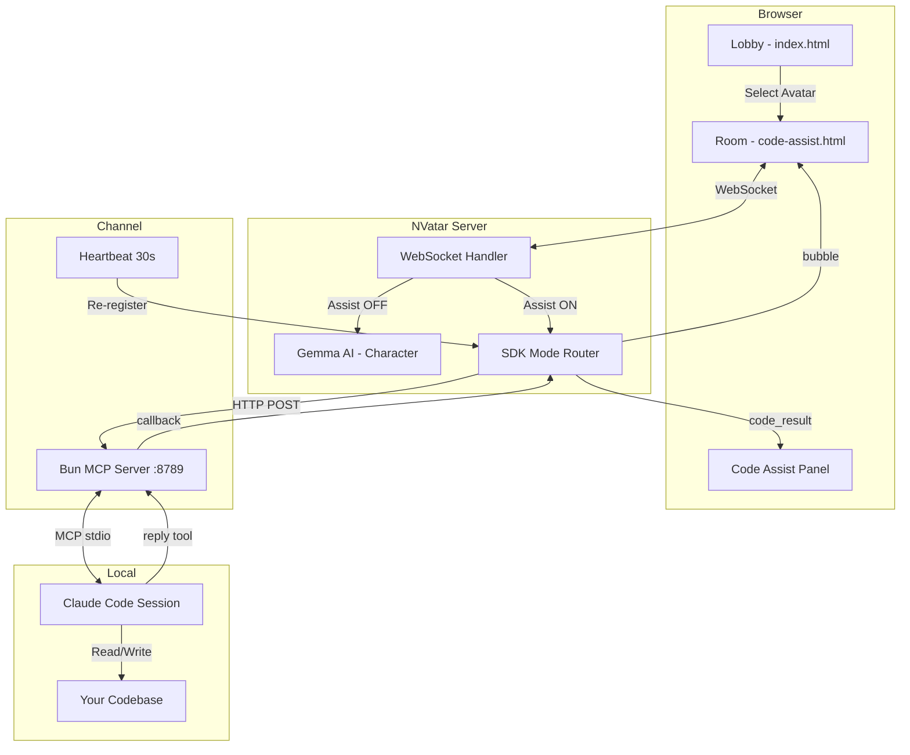

# NVatar Code Assist

> **Your 3D AI avatar becomes a code assistant — powered by Claude Code.**

NVatar Code Assist connects your [NVatar](https://github.com/nskit-io/nvatar-demo) avatar room to a local [Claude Code](https://claude.ai/claude-code) session via MCP channels. Give code commands to your avatar, and Claude Code executes them on your machine.

**[Live Demo](https://nskit-io.github.io/nvatar-code-assist/)** · [한국어](docs/README_KO.md) · [日本語](docs/README_JA.md) · [中文](docs/README_ZH.md)

---

## How It Works



## Claude Code Channel

NVatar Code Assist uses **Claude Code Channels** — an MCP-based plugin system that lets external apps communicate with a running Claude Code session.



The `channel/` directory contains a ready-to-use Bun MCP server. No additional configuration needed — just install and run:

```bash
cd channel && bun install          # one-time setup
NVATAR_CHANNEL_UUID=<uuid> claude --dangerously-load-development-channels server:nvatar
```

Claude Code launches the channel server automatically. The channel registers with the NVatar server via HTTP and relays messages bidirectionally.

> For more details on Claude Code Channels and MCP, see the [Claude Code documentation](https://docs.anthropic.com/en/docs/claude-code).

## Quick Start

### Prerequisites

- [Claude Code](https://claude.ai/claude-code) v2.1.80+
- [Bun](https://bun.sh/) runtime

> **Note:** The NVatar server is hosted at `https://nvatar.nskit.io`. This is the only publicly available server — local self-hosting is not supported for public users. If you're interested in deploying NVatar on your own infrastructure (enterprise / standalone), please [contact us](mailto:nskit@nskit.io).

### Step 1: Clone & Install

```bash
git clone https://github.com/nskit-io/nvatar-code-assist.git
cd nvatar-code-assist/channel
bun install
```

### Step 2: Open the Lobby

Visit **[https://nskit-io.github.io/nvatar-code-assist/](https://nskit-io.github.io/nvatar-code-assist/)**



1. Set **NVatar Server** URL (default: `https://nvatar.nskit.io`)
2. Click **Gen** to generate a Channel UUID
3. Copy the channel start command shown below the UUID

### Step 3: Start Claude Code Channel

Run the copied command in your terminal:

```bash
NVATAR_CHANNEL_UUID=<your-uuid> claude --dangerously-load-development-channels server:nvatar
```

> **Important:** Start the channel BEFORE entering the room. The channel process must be running for code commands to work.

### Step 4: Enter Room & Toggle Assist

1. Select your avatar in the lobby and enter the room
2. Chat normally with your avatar (greeting, name setup, etc.)
3. When ready for code work, click **⚡ Assist** in the toolbar
4. Give code commands — Claude Code executes them!



## Architecture



## Two Modes

### Normal Mode (default)

Your avatar is a conversational AI companion powered by Gemma. It has personality, memory, emotions, and speaks with TTS. Daily conversations are saved and the avatar evolves over time.

If you ask for code work while in Normal Mode, the avatar will guide you:
> "코드 작업은 ⚡ Assist 버튼을 눌러서 비서모드를 켜야 해요!"

### Code Assist Mode (⚡ toggle)

Messages are relayed directly to Claude Code — no Gemma involvement. The avatar becomes a transparent pipe:

| Action | Behavior |
|--------|----------|
| Your message | → Claude Code (direct relay) |
| Progress update | ← Avatar speaks it |
| Final result | ← Avatar speaks it + Code Panel |
| Ask avatar's opinion | → Gemma responds (with result context) |

### Privacy & Data

> **Important:** Code Assist mode does NOT save any conversation to the avatar's memory.

| | Normal Mode | Code Assist Mode |
|---|---|---|
| **Conversation log** | Saved to avatar memory | Not saved |
| **Emotion tracking** | Active (joy, sadness, etc.) | Disabled |
| **Personality evolution** | Active (traits develop over time) | Disabled |
| **Code results** | N/A | Saved to Code Panel + SQLite (separate from avatar memory) |

Your daily conversations with the avatar build its personality and emotional bond over time. Code assist conversations are completely isolated — they won't affect your avatar's character or memory. When you toggle back to Normal Mode, the avatar continues from where you left off in your personal conversation.

**Opinion detection** works in 4 languages:
- 🇰🇷 "어떻게 생각해?", "네 의견은?"
- 🇺🇸 "What do you think?", "Your opinion?"
- 🇯🇵 "どう思う?", "意見は?"
- 🇨🇳 "你觉得怎么样?", "你的意见?"

## URL Parameters

| Param | Default | Description |
|-------|---------|-------------|
| `avatar` | - | Avatar ID |
| `vrm` | Victoria_Rubin | VRM model URL |
| `channel` | - | Channel UUID |
| `server` | `https://nvatar.nskit.io` | NVatar server URL |
| `assist` | `0` | Auto-enable assist mode (`1` = ON) |
| `ctx` | `0` | Save code conversations to avatar memory |
| `wrap` | `1` | Character wrapping (Gemma) for responses |

## NVatarSDK API

The room exposes `window.NVatarSDK` for external integration:

```javascript
// Subscribe to code results
NVatarSDK.onLookupResult = (data) => {
  console.log(data.query, data.items);
};

// Read stored results
NVatarSDK.getLookupResults();    // all results
NVatarSDK.getUnreadCount();      // unread count
NVatarSDK.clearLookupResults();  // clear all
```

## Channel Configuration

### Environment Variables

The only variable you need to set is `NVATAR_CHANNEL_UUID` — it must match the UUID generated in the lobby page.

```bash
NVATAR_CHANNEL_UUID=<your-uuid> claude --dangerously-load-development-channels server:nvatar
```

All other configuration (server URL, port, authentication) is handled automatically.

### Heartbeat

The channel server re-registers with NVatar every 30 seconds. This means:
- NVatar server restarts → channel auto-reconnects within 30s
- No manual re-registration needed

### Enterprise Self-Hosting

Self-hosting NVatar requires a dedicated server with GPU (for Gemma LLM) and API keys (for ElevenLabs TTS). For enterprise deployment inquiries, please [contact us](mailto:nskit@nskit.io).

If self-hosting, configure CORS for your lobby domain:

```python
# FastAPI
app.add_middleware(CORSMiddleware,
    allow_origins=["https://your-domain.com"],
    allow_methods=["*"], allow_headers=["*"])
```

## Project Structure

```
nvatar-code-assist/
├── index.html              # Lobby — avatar selection + server config
├── code-assist.html        # Room — 3D avatar + chat + code panel
├── js/room/                # Room modules (16 files)
│   ├── state.js            # Shared state + API_BASE resolution
│   ├── main-assist.js      # Code assist toggle + SDK connect
│   ├── chat.js             # WebSocket chat + code panel
│   ├── lookup.js           # NVatarSDK public API
│   ├── scene.js            # Three.js 3D scene
│   ├── animation.js        # Mixamo VRM animation
│   ├── i18n.js             # 4-language UI translations
│   ├── tts.js / stt.js     # Voice (ElevenLabs TTS, Whisper STT)
│   └── ...                 # mood, roaming, bubble, mobile, walk
├── vrm/
│   ├── models.json         # Static model list (offline fallback)
│   └── thumbnails/         # VRM avatar thumbnails (256×256)
├── channel/
│   ├── server.ts           # MCP channel server (Bun)
│   └── package.json
└── docs/
    ├── README_KO.md
    ├── README_JA.md
    └── README_ZH.md
```

## Service Limits

| Service | Endpoint | Notes |
|---------|----------|-------|
| **NVatar Server** | `nvatar.nskit.io` | Public hosted server. Self-hosting not available for public use. |
| **TTS (Voice)** | ElevenLabs via `nvatar.nskit.io` | Rate limits may apply due to API quota. If TTS becomes unavailable, the avatar continues with text bubbles only — all features work normally without voice. |
| **STT (Speech-to-text)** | `whisper.nskit.io` (local Whisper) | Locally hosted, generally stable. Use text input as fallback. |

- TTS uses a shared ElevenLabs API quota. During heavy usage, voice output may temporarily stop. This does not affect chat or code relay — the avatar simply speaks through text bubbles instead.
- For enterprise deployment with dedicated resources, please [contact us](mailto:nskit@nskit.io).

## Troubleshooting

| Symptom | Cause | Fix |
|---------|-------|-----|
| "채널 전달 실패: 401" | Token mismatch | Restart channel with latest code |
| Avatar doesn't relay | Assist toggle is OFF | Click ⚡ Assist button |
| "서버 연결 대기 중" | Server URL wrong | Check NVatar Server field in lobby |
| Code panel empty after refresh | Different channel UUID | Use same UUID as channel process |
| TTS not playing on refresh | Browser autoplay policy | Click anywhere first, then refresh |
| Channel lost after server restart | In-memory registration cleared | Heartbeat auto-recovers in 30s |

## License

Apache-2.0

---

Built with [NVatar](https://github.com/nskit-io/nvatar-demo) — AI 3D Avatar Chat Platform
