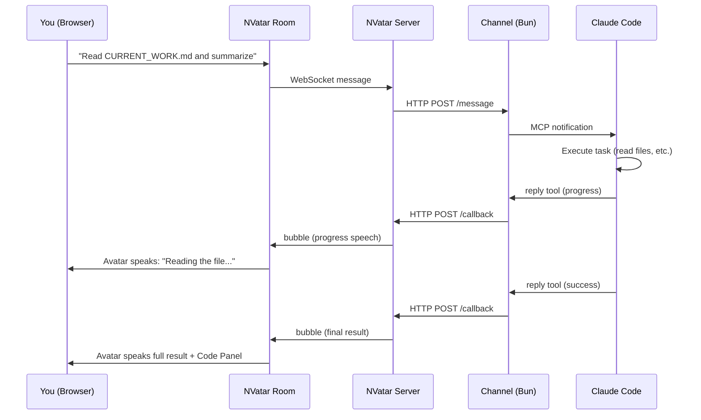
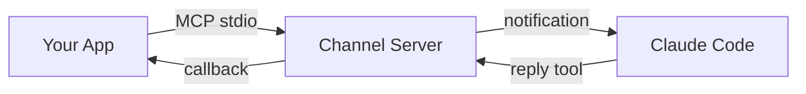
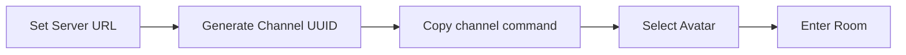
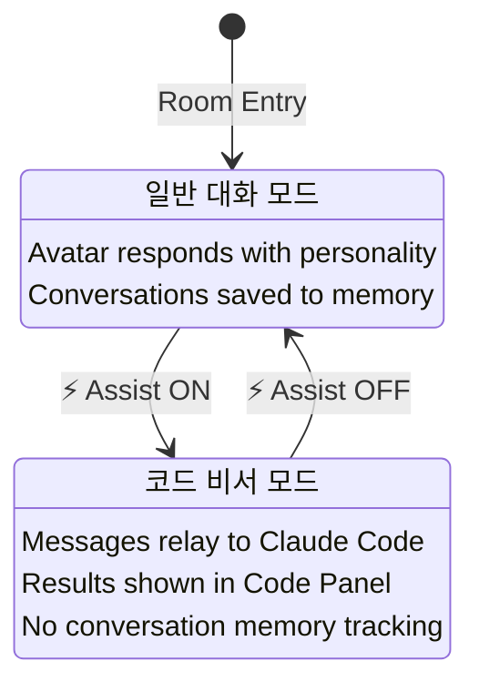
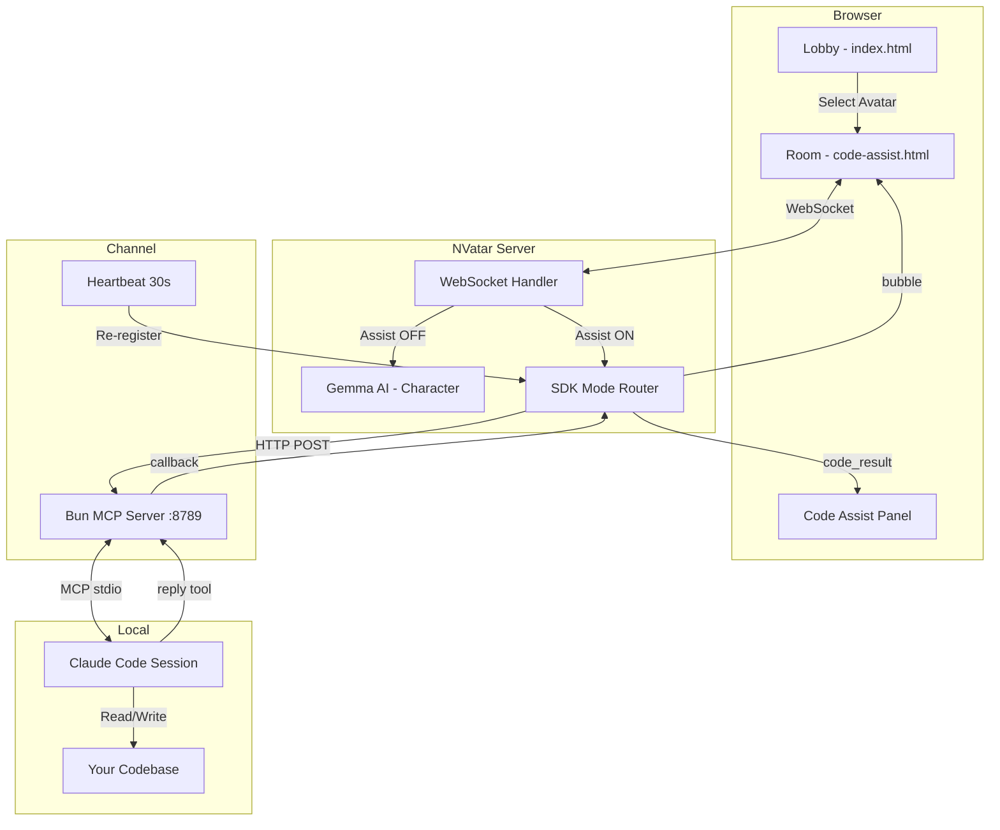

# NVatar Code Assist

> **3D AIアバターがコードアシスタントに -- Claude Codeで動作します。**

NVatar Code Assistは、[NVatar](https://github.com/nskit-io/nvatar-demo)のアバタールームをローカルの[Claude Code](https://claude.ai/claude-code)セッションとMCPチャネルで接続します。アバターにコード指示を出すと、Claude Codeがお使いのマシン上で実行します。

**[Live Demo](https://nskit-io.github.io/nvatar-code-assist/)** · [English](../README.md) · [한국어](README_KO.md) · [中文](README_ZH.md)

---

## 仕組み



## Claude Code チャンネルとは

NVatar Code Assistは**Claude Code Channel**を使用します。MCPベースのプラグインシステムで、外部アプリが実行中のClaude Codeセッションと通信できるようにします。



`channel/`ディレクトリにすぐ使えるBun MCPサーバーが含まれています。追加設定なしでインストール後すぐ実行できます:

```bash
cd channel && bun install          # 初回のみ
NVATAR_CHANNEL_UUID=<uuid> claude --dangerously-load-development-channels server:nvatar
```

Claude Codeがチャンネルサーバーを自動的に起動します。チャンネルはNVatarサーバーにHTTPで登録され、メッセージを双方向に中継します。

> Claude Code ChannelとMCPの詳細は[Claude Codeドキュメント](https://docs.anthropic.com/en/docs/claude-code)をご参照ください。

## クイックスタート

### 前提条件

- [Claude Code](https://claude.ai/claude-code) v2.1.80以上
- [Bun](https://bun.sh/) ランタイム

> **ご案内:** NVatarサーバーは`https://nvatar.nskit.io`でホスティングされています。ローカルセルフホスティングはサポートされていません。自社インフラへの導入をご検討の場合は[お問い合わせください](mailto:nskit@nskit.io)。
- NVatar Serverへのアクセス (`https://nvatar.nskit.io` またはセルフホスト)

### Step 1: クローンとインストール

```bash
git clone https://github.com/nskit-io/nvatar-code-assist.git
cd nvatar-code-assist/channel
bun install
```

### Step 2: ロビーを開く

**[https://nskit-io.github.io/nvatar-code-assist/](https://nskit-io.github.io/nvatar-code-assist/)** にアクセスします。



1. **NVatar Server** URLを設定します（デフォルト: `https://nvatar.nskit.io`）
2. **Gen** ボタンをクリックしてChannel UUIDを生成します
3. UUIDの下に表示されるチャネル起動コマンドをコピーします

### Step 3: Claude Codeチャネルを起動

コピーしたコマンドをターミナルで実行します:

```bash
NVATAR_CHANNEL_UUID=<your-uuid> claude --dangerously-load-development-channels server:nvatar
```

> **重要:** ルームに入室する前にチャネルを起動してください。チャネルプロセスが実行中でなければ、コード指示は機能しません。

### Step 4: ルーム入室とAssist切り替え

1. ロビーでアバターを選択し、ルームに入室します
2. アバターと通常の会話をします（挨拶、名前の設定など）
3. コード作業が必要になったら、ツールバーの **Assist** ボタンをクリックします
4. コード指示を出すと、Claude Codeが実行します



## アーキテクチャ



## 2つのモード

### 通常モード（デフォルト）

アバターはGemmaベースの対話型AIコンパニオンです。固有の性格、記憶、感情を持ち、TTSで音声会話をします。日常の会話は自動保存され、アバターは時間の経過とともに成長していきます。

通常モードでコード作業をリクエストすると、アバターが案内します:
> "コード作業は Assist ボタンを押してアシストモードをオンにしてくださいね！"

### コードアシストモード（Assistトグル）

メッセージはClaude Codeに直接転送されます。Gemmaを介さず、アバターは透過的なパイプとして機能します:

| 操作 | 動作 |
|------|------|
| ユーザーのメッセージ | Claude Codeへ直接転送 |
| 進捗アップデート | アバターが音声で伝達 |
| 最終結果 | アバター音声伝達 + Code Panel表示 |
| アバターへの意見リクエスト | Gemmaが結果コンテキストとともに応答 |

### プライバシーとデータ

> **重要:** Code Assistモードでは、会話内容はアバターのメモリに保存されません。

| | 通常モード | Code Assistモード |
|---|---|---|
| **会話ログ** | アバターメモリに保存 | 保存しない |
| **感情トラッキング** | 有効（喜び、悲しみなど） | 無効 |
| **性格の発展** | 有効（時間とともに変化） | 無効 |
| **コード結果** | 該当なし | Code Panel + SQLiteに別途保存 |

日常会話を通じてアバターの性格と感情が発展します。Code Assistの会話は完全に隔離されており、アバターのキャラクターや記憶に影響を与えません。通常モードに戻ると、以前の日常会話から続けて会話できます。

**意見検出**は4言語に対応しています:
- 🇰🇷 "어떻게 생각해?", "네 의견은?"
- 🇺🇸 "What do you think?", "Your opinion?"
- 🇯🇵 "どう思う?", "意見は?"
- 🇨🇳 "你觉得怎么样?", "你的意见?"

## URLパラメータ

| パラメータ | デフォルト | 説明 |
|-----------|-----------|------|
| `avatar` | - | アバターID |
| `vrm` | Victoria_Rubin | VRMモデルURL |
| `channel` | - | Channel UUID |
| `server` | `https://nvatar.nskit.io` | NVatarサーバーURL |
| `assist` | `0` | アシストモード自動有効化（`1` = ON） |
| `ctx` | `0` | コード会話をアバターメモリに保存 |
| `wrap` | `1` | レスポンスへのキャラクターラッピング（Gemma） |

## NVatarSDK API

ルームは外部連携用に `window.NVatarSDK` を公開しています:

```javascript
// Subscribe to code results
NVatarSDK.onLookupResult = (data) => {
  console.log(data.query, data.items);
};

// Read stored results
NVatarSDK.getLookupResults();    // all results
NVatarSDK.getUnreadCount();      // unread count
NVatarSDK.clearLookupResults();  // clear all
```

## チャネル設定

### 環境変数

| 変数 | デフォルト | 説明 |
|------|-----------|------|
| `NVATAR_CHANNEL_UUID` | 自動生成 | チャネル識別子（ロビーで生成したUUIDと同一に設定） |
| `NVATAR_CHANNEL_PORT` | `8789` | チャネルHTTPサーバーポート |

> 通常設定が必要なのは`NVATAR_CHANNEL_UUID`のみです。ロビーで生成したUUIDと一致させてください。

### ハートビート

チャネルサーバーは30秒ごとにNVatarサーバーへ再登録します。これは以下を意味します:
- NVatarサーバーが再起動しても、30秒以内に自動再接続されます
- 手動での再登録は不要です

### セルフホスト時のCORS設定

GitHub Pagesでロビーをホストしつつ独自のNVatarサーバーを使用する場合:

```python
# FastAPI
app.add_middleware(CORSMiddleware,
    allow_origins=["https://your-username.github.io"],
    allow_methods=["*"], allow_headers=["*"])
```

## プロジェクト構成

```
nvatar-code-assist/
├── index.html              # Lobby -- アバター選択 + サーバー設定
├── code-assist.html        # Room -- 3Dアバター + チャット + コードパネル
├── js/room/                # Roomモジュール（16ファイル）
│   ├── state.js            # 共有ステート + API_BASE解決
│   ├── main-assist.js      # コードアシストトグル + SDK接続
│   ├── chat.js             # WebSocketチャット + コードパネル
│   ├── lookup.js           # NVatarSDK公開API
│   ├── scene.js            # Three.js 3Dシーン
│   ├── animation.js        # Mixamo VRMアニメーション
│   ├── i18n.js             # 4言語UI翻訳
│   ├── tts.js / stt.js     # 音声（ElevenLabs TTS, Whisper STT）
│   └── ...                 # mood, roaming, bubble, mobile, walk
├── vrm/
│   ├── models.json         # 静的モデルリスト（オフラインフォールバック）
│   └── thumbnails/         # VRMアバターサムネイル（256x256）
├── channel/
│   ├── server.ts           # MCPチャネルサーバー（Bun）
│   └── package.json
└── docs/
    ├── README_KO.md
    ├── README_JA.md
    └── README_ZH.md
```

## サービス制限

| サービス | エンドポイント | 備考 |
|---------|--------------|------|
| **NVatarサーバー** | `nvatar.nskit.io` | 公開ホスティングサーバー。セルフホスティング不可。 |
| **TTS（音声）** | ElevenLabs via `nvatar.nskit.io` | APIクォータによるレート制限の可能性あり。TTS不可時はテキスト吹き出しで正常動作。 |
| **STT（音声認識）** | `whisper.nskit.io`（ローカルWhisper） | 自社ホスティングで安定稼働。障害時はテキスト入力をご利用ください。 |

- TTSは共有ElevenLabs APIクォータを使用しています。利用が集中するとTTS一時停止の可能性がありますが、チャットとコードリレーはテキスト吹き出しで正常に動作します。
- 専用リソースが必要な企業導入は[お問い合わせください](mailto:nskit@nskit.io)。

## トラブルシューティング

| 症状 | 原因 | 対処法 |
|------|------|--------|
| "채널 전달 실패: 401" | トークン不一致 | 最新コードでチャネルを再起動してください |
| アバターがコマンドを転送しない | Assistトグルがオフ | Assistボタンをクリックしてください |
| "서버 연결 대기 중" | サーバーURLが不正 | ロビーのNVatar Serverフィールドを確認してください |
| リロード後にコードパネルが空 | Channel UUIDが異なる | チャネルプロセスと同じUUIDを使用してください |
| リロード後にTTSが再生されない | ブラウザの自動再生ポリシー | 画面内をクリックしてからリロードしてください |
| サーバー再起動後にチャネルが切断 | メモリ内の登録情報がクリア | ハートビートが30秒以内に自動復旧します |

## ライセンス

Apache-2.0

---

Built with [NVatar](https://github.com/nskit-io/nvatar-demo) -- AI 3D Avatar Chat Platform
