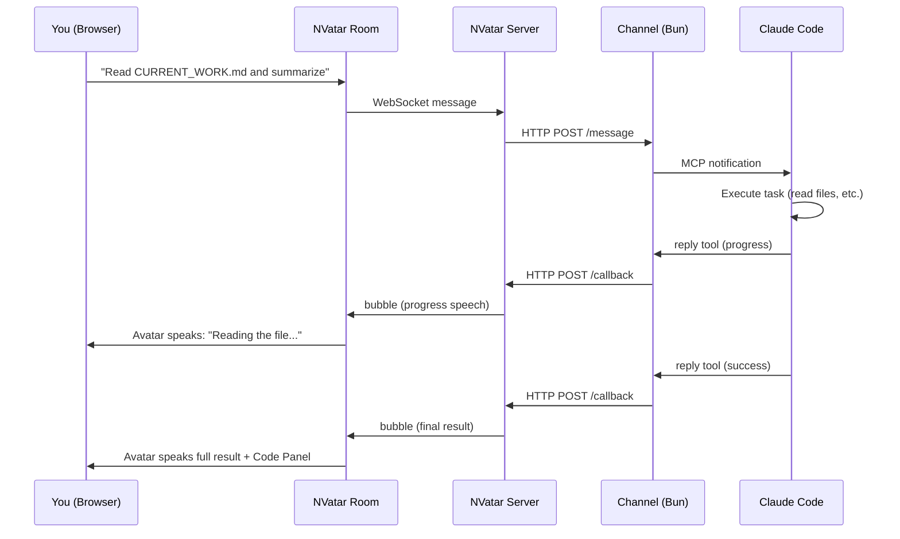
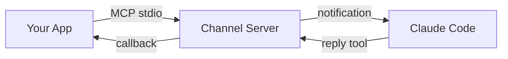
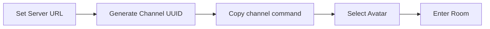
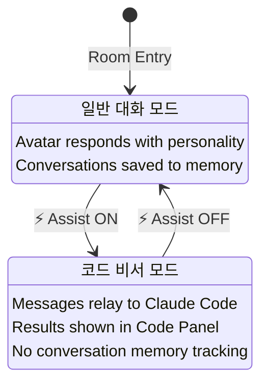
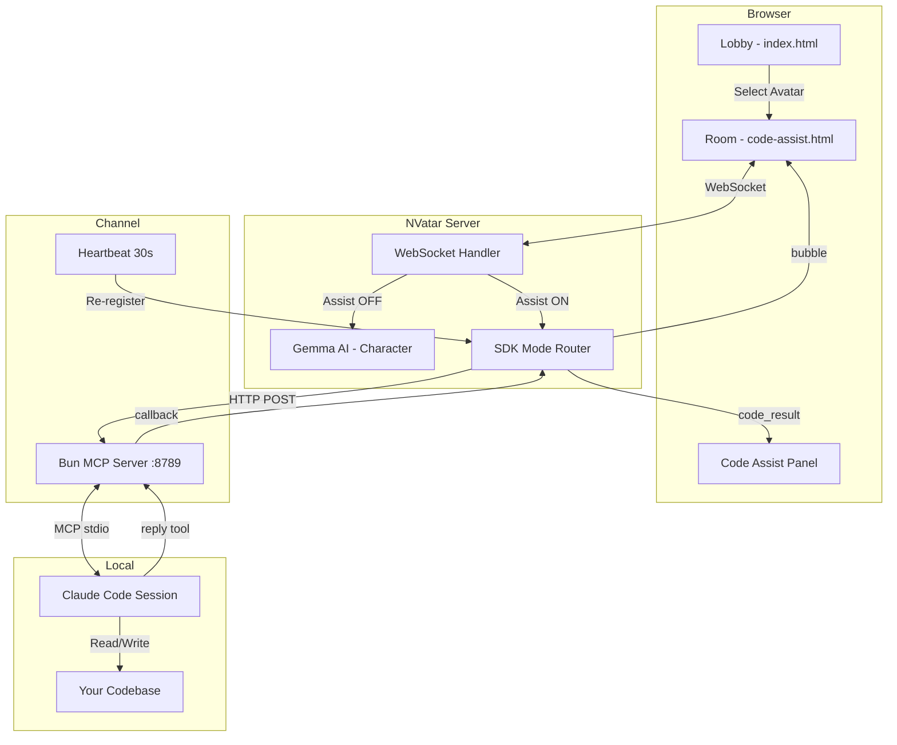

# NVatar Code Assist

> **3D AI 아바타가 코드 비서가 됩니다 -- Claude Code 기반.**

NVatar Code Assist는 [NVatar](https://github.com/nskit-io/nvatar-demo) 아바타 룸을 로컬 [Claude Code](https://claude.ai/claude-code) 세션과 MCP 채널로 연결합니다. 아바타에게 코드 명령을 내리면, Claude Code가 여러분의 로컬 머신에서 실행합니다.

**[Live Demo](https://nskit-io.github.io/nvatar-code-assist/)** · [English](../README.md) · [日本語](README_JA.md) · [中文](README_ZH.md)

---

## 동작 원리



## Claude Code 채널이란?

NVatar Code Assist는 **Claude Code Channel**을 사용합니다. MCP 기반 플러그인 시스템으로, 외부 앱이 실행 중인 Claude Code 세션과 통신할 수 있게 해줍니다.



`channel/` 디렉토리에 바로 사용 가능한 Bun MCP 서버가 포함되어 있습니다. 별도 설정 없이 설치 후 실행하면 됩니다:

```bash
cd channel && bun install          # 최초 1회
NVATAR_CHANNEL_UUID=<uuid> claude --dangerously-load-development-channels server:nvatar
```

Claude Code가 채널 서버를 자동으로 실행합니다. 채널은 NVatar 서버에 HTTP로 등록되고, 메시지를 양방향으로 중계합니다.

> Claude Code Channel과 MCP에 대한 자세한 내용은 [Claude Code 문서](https://docs.anthropic.com/en/docs/claude-code)를 참고하세요.

## 빠른 시작

### 사전 준비

- [Claude Code](https://claude.ai/claude-code) v2.1.80 이상
- [Bun](https://bun.sh/) 런타임

> **안내:** NVatar 서버는 `https://nvatar.nskit.io`에서 호스팅됩니다. 로컬 셀프호스팅은 지원되지 않습니다. 자체 인프라에 NVatar를 도입하려면 [문의해 주세요](mailto:nskit@nskit.io).

### Step 1: 클론 및 설치

```bash
git clone https://github.com/nskit-io/nvatar-code-assist.git
cd nvatar-code-assist/channel
bun install
```

### Step 2: 로비 접속

**[https://nskit-io.github.io/nvatar-code-assist/](https://nskit-io.github.io/nvatar-code-assist/)** 에 접속합니다.



1. **NVatar Server** URL을 설정합니다 (기본값: `https://nvatar.nskit.io`)
2. **Gen** 버튼을 클릭하여 Channel UUID를 생성합니다
3. UUID 아래에 표시되는 채널 시작 명령어를 복사합니다

### Step 3: Claude Code 채널 시작

복사한 명령어를 터미널에서 실행합니다:

```bash
NVATAR_CHANNEL_UUID=<your-uuid> claude --dangerously-load-development-channels server:nvatar
```

> **중요:** 룸에 입장하기 전에 채널을 먼저 시작하세요. 채널 프로세스가 실행 중이어야 코드 명령이 정상 동작합니다.

### Step 4: 룸 입장 및 Assist 전환

1. 로비에서 아바타를 선택하고 룸에 입장합니다
2. 아바타와 일반 대화를 합니다 (인사, 이름 설정 등)
3. 코드 작업이 필요하면 툴바의 **Assist** 버튼을 클릭합니다
4. 코드 명령을 내리면 Claude Code가 실행합니다



## 아키텍처



## 두 가지 모드

### 일반 모드 (기본)

아바타는 Gemma 기반의 대화형 AI 컴패니언입니다. 고유한 성격, 기억, 감정을 가지고 있으며 TTS로 음성 대화를 합니다. 일상 대화는 자동 저장되고, 아바타는 시간이 지남에 따라 진화합니다.

일반 모드에서 코드 작업을 요청하면 아바타가 안내합니다:
> "코드 작업은 Assist 버튼을 눌러서 비서모드를 켜야 해요!"

### 코드 비서 모드 (Assist 토글)

메시지가 Claude Code로 직접 전달됩니다. Gemma를 거치지 않으며, 아바타는 투명한 파이프 역할을 합니다:

| 동작 | 처리 방식 |
|------|-----------|
| 사용자 메시지 | Claude Code로 직접 전달 |
| 진행 상황 업데이트 | 아바타가 음성으로 전달 |
| 최종 결과 | 아바타 음성 전달 + Code Panel 표시 |
| 아바타 의견 요청 | Gemma가 결과 컨텍스트와 함께 응답 |

### 개인정보 및 데이터

> **중요:** Code Assist 모드에서는 대화 내용이 아바타 메모리에 저장되지 않습니다.

| | 일반 모드 | Code Assist 모드 |
|---|---|---|
| **대화 기록** | 아바타 메모리에 저장 | 저장하지 않음 |
| **감정 추적** | 활성 (기쁨, 슬픔 등) | 비활성 |
| **성격 발전** | 활성 (시간이 지나며 성격 변화) | 비활성 |
| **코드 결과** | 해당 없음 | Code Panel + SQLite에 별도 저장 |

일상 대화를 통해 아바타의 성격과 감정이 발전합니다. Code Assist 대화는 완전히 격리되어 있어 아바타의 캐릭터나 기억에 영향을 주지 않습니다. 일반 모드로 돌아오면 이전 일상 대화에서 이어서 대화합니다.

**의견 감지**는 4개 언어를 지원합니다:
- 🇰🇷 "어떻게 생각해?", "네 의견은?"
- 🇺🇸 "What do you think?", "Your opinion?"
- 🇯🇵 "どう思う?", "意見は?"
- 🇨🇳 "你觉得怎么样?", "你的意见?"

## URL 파라미터

| 파라미터 | 기본값 | 설명 |
|---------|--------|------|
| `avatar` | - | 아바타 ID |
| `vrm` | Victoria_Rubin | VRM 모델 URL |
| `channel` | - | Channel UUID |
| `server` | `https://nvatar.nskit.io` | NVatar 서버 URL |
| `assist` | `0` | 비서 모드 자동 활성화 (`1` = ON) |
| `ctx` | `0` | 코드 대화를 아바타 메모리에 저장 |
| `wrap` | `1` | 응답에 캐릭터 래핑 (Gemma) 적용 |

## NVatarSDK API

룸은 외부 연동을 위해 `window.NVatarSDK`를 제공합니다:

```javascript
// Subscribe to code results
NVatarSDK.onLookupResult = (data) => {
  console.log(data.query, data.items);
};

// Read stored results
NVatarSDK.getLookupResults();    // all results
NVatarSDK.getUnreadCount();      // unread count
NVatarSDK.clearLookupResults();  // clear all
```

## 채널 설정

### 환경 변수

| 변수 | 기본값 | 설명 |
|------|--------|------|
| `NVATAR_CHANNEL_UUID` | 자동 생성 | 채널 식별자 (로비와 동일하게 설정) |
| `NVATAR_SERVER_URL` | `http://localhost:54444` | NVatar 서버 엔드포인트 |
| `NVATAR_CHANNEL_PORT` | `8789` | 채널 HTTP 서버 포트 |
| `NVATAR_CHANNEL_SECRET` | `nvatar_ch_2026_secret` | 인증 토큰 |

### 하트비트

채널 서버는 30초마다 NVatar 서버에 재등록합니다. 이는 다음을 의미합니다:
- NVatar 서버가 재시작되면 30초 내에 자동으로 재연결됩니다
- 수동으로 재등록할 필요가 없습니다

### 셀프 호스팅 시 CORS 설정

GitHub Pages에서 로비를 호스팅하면서 별도의 NVatar 서버를 사용할 경우:

```python
# FastAPI
app.add_middleware(CORSMiddleware,
    allow_origins=["https://your-username.github.io"],
    allow_methods=["*"], allow_headers=["*"])
```

## 프로젝트 구조

```
nvatar-code-assist/
├── index.html              # Lobby -- 아바타 선택 + 서버 설정
├── code-assist.html        # Room -- 3D 아바타 + 채팅 + 코드 패널
├── js/room/                # Room 모듈 (16개 파일)
│   ├── state.js            # 공유 상태 + API_BASE 결정
│   ├── main-assist.js      # 코드 비서 토글 + SDK 연결
│   ├── chat.js             # WebSocket 채팅 + 코드 패널
│   ├── lookup.js           # NVatarSDK 공개 API
│   ├── scene.js            # Three.js 3D 씬
│   ├── animation.js        # Mixamo VRM 애니메이션
│   ├── i18n.js             # 4개 언어 UI 번역
│   ├── tts.js / stt.js     # 음성 (ElevenLabs TTS, Whisper STT)
│   └── ...                 # mood, roaming, bubble, mobile, walk
├── vrm/
│   ├── models.json         # 정적 모델 목록 (오프라인 폴백)
│   └── thumbnails/         # VRM 아바타 썸네일 (256x256)
├── channel/
│   ├── server.ts           # MCP 채널 서버 (Bun)
│   └── package.json
└── docs/
    ├── README_KO.md
    ├── README_JA.md
    └── README_ZH.md
```

## 서비스 제한

| 서비스 | 엔드포인트 | 비고 |
|--------|-----------|------|
| **NVatar 서버** | `nvatar.nskit.io` | 공개 호스팅 서버. 셀프호스팅 불가. |
| **TTS (음성)** | ElevenLabs via `nvatar.nskit.io` | API 쿼터로 인한 속도 제한 가능. TTS 불가 시 텍스트 말풍선으로 정상 동작. |
| **STT (음성 인식)** | `whisper.nskit.io` (로컬 Whisper) | 자체 호스팅으로 안정적. 장애 시 텍스트 입력 사용. |

- TTS는 공유 ElevenLabs API 쿼터를 사용합니다. 사용량이 많을 때 음성 출력이 일시 중단될 수 있습니다. 채팅과 코드 relay에는 영향 없이 텍스트 말풍선으로 계속 동작합니다.
- 전용 리소스가 필요한 기업 도입은 [문의해 주세요](mailto:nskit@nskit.io).

## 문제 해결

| 증상 | 원인 | 해결 방법 |
|------|------|-----------|
| "채널 전달 실패: 401" | 토큰 불일치 | 최신 코드로 채널을 재시작하세요 |
| 아바타가 명령을 전달하지 않음 | Assist 토글이 꺼져 있음 | Assist 버튼을 클릭하세요 |
| "서버 연결 대기 중" | 서버 URL이 잘못됨 | 로비의 NVatar Server 필드를 확인하세요 |
| 새로고침 후 코드 패널이 비어 있음 | Channel UUID가 다름 | 채널 프로세스와 동일한 UUID를 사용하세요 |
| 새로고침 후 TTS가 재생되지 않음 | 브라우저 자동 재생 정책 | 아무 곳이나 클릭한 후 새로고침하세요 |
| 서버 재시작 후 채널 끊김 | 메모리 내 등록 정보 초기화 | 하트비트가 30초 내에 자동 복구합니다 |

## 라이선스

Apache-2.0

---

Built with [NVatar](https://github.com/nskit-io/nvatar-demo) -- AI 3D Avatar Chat Platform
