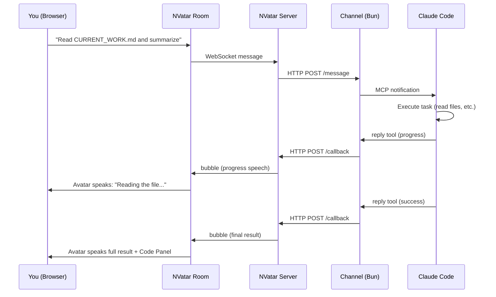
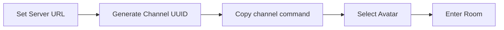
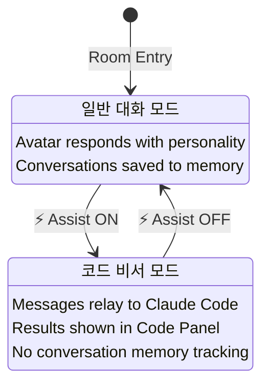
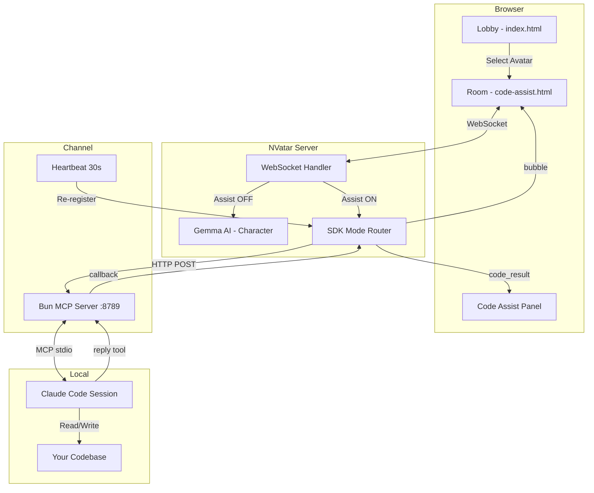

# NVatar Code Assist

> **3D AI虚拟形象化身代码助手 -- 基于Claude Code驱动。**

NVatar Code Assist通过MCP通道，将[NVatar](https://github.com/nskit-io/nvatar-demo)虚拟形象房间与本地[Claude Code](https://claude.ai/claude-code)会话连接起来。向虚拟形象下达代码指令，Claude Code便会在您的本地机器上执行。

**[Live Demo](https://nskit-io.github.io/nvatar-code-assist/)** · [English](../README.md) · [한국어](README_KO.md) · [日本語](README_JA.md)

---

## 工作原理



## 快速开始

### 前置条件

- [Claude Code](https://claude.ai/claude-code) v2.1.80及以上版本
- [Bun](https://bun.sh/) 运行时
- NVatar Server访问权限（`https://nvatar.nskit.io` 或自建服务器）

### Step 1: 克隆与安装

```bash
git clone https://github.com/nskit-io/nvatar-code-assist.git
cd nvatar-code-assist/channel
bun install
```

### Step 2: 打开大厅

访问 **[https://nskit-io.github.io/nvatar-code-assist/](https://nskit-io.github.io/nvatar-code-assist/)**



1. 设置 **NVatar Server** URL（默认值: `https://nvatar.nskit.io`）
2. 点击 **Gen** 按钮生成Channel UUID
3. 复制UUID下方显示的通道启动命令

### Step 3: 启动Claude Code通道

在终端中执行复制的命令:

```bash
NVATAR_CHANNEL_UUID=<your-uuid> claude --dangerously-load-development-channels server:nvatar
```

> **重要提示:** 请在进入房间之前先启动通道。通道进程必须处于运行状态，代码指令才能正常工作。

### Step 4: 进入房间并切换Assist模式

1. 在大厅选择虚拟形象并进入房间
2. 先与虚拟形象进行普通对话（打招呼、设置名称等）
3. 需要进行代码工作时，点击工具栏的 **Assist** 按钮
4. 下达代码指令，Claude Code即刻执行



## 架构



## 两种模式

### 普通模式（默认）

虚拟形象是基于Gemma的对话型AI伙伴。它拥有独特的性格、记忆和情感，通过TTS进行语音对话。日常对话会自动保存，虚拟形象会随着时间推移不断成长。

在普通模式下请求代码工作时，虚拟形象会引导您:
> "代码工作需要点击 Assist 按钮开启助手模式哦！"

### 代码助手模式（Assist切换）

消息会直接转发到Claude Code，不经过Gemma处理。虚拟形象充当透明的传输管道:

| 操作 | 行为 |
|------|------|
| 用户消息 | 直接转发至Claude Code |
| 进度更新 | 虚拟形象语音播报 |
| 最终结果 | 虚拟形象语音播报 + Code Panel显示 |
| 询问虚拟形象意见 | Gemma结合结果上下文进行回复 |

**意见检测**支持4种语言:
- 🇰🇷 "어떻게 생각해?", "네 의견은?"
- 🇺🇸 "What do you think?", "Your opinion?"
- 🇯🇵 "どう思う?", "意見は?"
- 🇨🇳 "你觉得怎么样?", "你的意见?"

## URL参数

| 参数 | 默认值 | 说明 |
|------|--------|------|
| `avatar` | - | 虚拟形象ID |
| `vrm` | Victoria_Rubin | VRM模型URL |
| `channel` | - | Channel UUID |
| `server` | `https://nvatar.nskit.io` | NVatar服务器URL |
| `assist` | `0` | 自动启用助手模式（`1` = 开启） |
| `ctx` | `0` | 将代码对话保存至虚拟形象记忆 |
| `wrap` | `1` | 对响应应用角色包装（Gemma） |

## NVatarSDK API

房间对外暴露 `window.NVatarSDK` 以支持外部集成:

```javascript
// Subscribe to code results
NVatarSDK.onLookupResult = (data) => {
  console.log(data.query, data.items);
};

// Read stored results
NVatarSDK.getLookupResults();    // all results
NVatarSDK.getUnreadCount();      // unread count
NVatarSDK.clearLookupResults();  // clear all
```

## 通道配置

### 环境变量

| 变量 | 默认值 | 说明 |
|------|--------|------|
| `NVATAR_CHANNEL_UUID` | 自动生成 | 通道标识符（需与大厅一致） |
| `NVATAR_SERVER_URL` | `http://localhost:54444` | NVatar服务器端点 |
| `NVATAR_CHANNEL_PORT` | `8789` | 通道HTTP服务器端口 |
| `NVATAR_CHANNEL_SECRET` | `nvatar_ch_2026_secret` | 认证令牌 |

### 心跳机制

通道服务器每30秒向NVatar服务器重新注册一次。这意味着:
- NVatar服务器重启后，通道会在30秒内自动重新连接
- 无需手动重新注册

### 自建服务器的CORS配置

在GitHub Pages上托管大厅页面并使用自建NVatar服务器时:

```python
# FastAPI
app.add_middleware(CORSMiddleware,
    allow_origins=["https://your-username.github.io"],
    allow_methods=["*"], allow_headers=["*"])
```

## 项目结构

```
nvatar-code-assist/
├── index.html              # 大厅 -- 虚拟形象选择 + 服务器配置
├── code-assist.html        # 房间 -- 3D虚拟形象 + 聊天 + 代码面板
├── js/room/                # 房间模块（16个文件）
│   ├── state.js            # 共享状态 + API_BASE解析
│   ├── main-assist.js      # 代码助手切换 + SDK连接
│   ├── chat.js             # WebSocket聊天 + 代码面板
│   ├── lookup.js           # NVatarSDK公开API
│   ├── scene.js            # Three.js 3D场景
│   ├── animation.js        # Mixamo VRM动画
│   ├── i18n.js             # 4语言UI翻译
│   ├── tts.js / stt.js     # 语音（ElevenLabs TTS, Whisper STT）
│   └── ...                 # mood, roaming, bubble, mobile, walk
├── vrm/
│   ├── models.json         # 静态模型列表（离线回退）
│   └── thumbnails/         # VRM虚拟形象缩略图（256x256）
├── channel/
│   ├── server.ts           # MCP通道服务器（Bun）
│   └── package.json
└── docs/
    ├── README_KO.md
    ├── README_JA.md
    └── README_ZH.md
```

## 故障排查

| 症状 | 原因 | 解决方法 |
|------|------|----------|
| "채널 전달 실패: 401" | 令牌不匹配 | 使用最新代码重启通道 |
| 虚拟形象不转发指令 | Assist开关未开启 | 点击Assist按钮 |
| "서버 연결 대기 중" | 服务器URL错误 | 检查大厅中的NVatar Server字段 |
| 刷新后代码面板为空 | Channel UUID不同 | 使用与通道进程相同的UUID |
| 刷新后TTS不播放 | 浏览器自动播放策略限制 | 先点击页面任意位置，再刷新 |
| 服务器重启后通道断开 | 内存中的注册信息已清除 | 心跳机制将在30秒内自动恢复 |

## 许可证

Apache-2.0

---

Built with [NVatar](https://github.com/nskit-io/nvatar-demo) -- AI 3D Avatar Chat Platform
